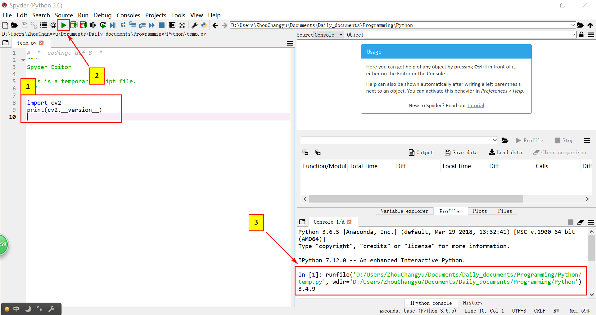
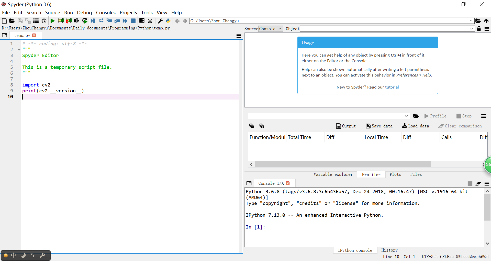

### Versions:

- Anaconda3 5.2.0 
- Python 3.6.5
- opencv-python 3.4.9.31

This blog might be out of date soon, but the method introduced will last for a long time.

#### 1. Download Anaconda

Previous versions of Anaconda are available in the [<font color=blue>archive(click to check)</font>](https://repo.anaconda.com/archive/). Considering the computer system, I choose to download <font color=blue>Anaconda3-5.2.0-Windows-x86_64.exe</font> including <font color=blue>Python 3.6.5</font>(since Python36 is more stable than Python37), so we need not to install Python seperately.

#### 2. Install Anaconda

Steps are shown on <font color=blue><u>https://docs.anaconda.com/anaconda/install/windows/</u></font>.
After installation, run Anaconda Navigator, it can be seen that <font color=blue>console_shortcut, Spyder and Jupyter notebook</font> have been installed as well.

#### 3. Install two packages —— numpy(necessary), matplotlib(optional)

Launch <font color=blue>console_shortcut</font>, type codes: 

```cpp
pip install numpy
```

Similarly, matplotlib can be installed by typing codes: 

```cpp
pip install matplotlib
```

#### 4. Install opencv-python

Considering stablility, I choose to install opencv 3.x by continuing to type codes in <font color=blue>console_shortcut</font>:   

```
pip install opencv-python==3.4.9.31
```

All available versions can be seen and downloaded from the website: 
<font color=blue><u>https://pypi.org/project/opencv-python/#history</u></font> 
By the way, installed packages can be checked by typing in `pip list`.

#### 5. Test

Launch <font color=blue>Spyder</font> in Anaconda Navigator, type in

```
import cv2
print(cv2.__version__)
```

click "Run" button.

<div>

</div>

The result is shown in the picture. 
<br/></br>

#### Plus

<font color=blue>Overview of Spyder :</font> 

> <font size=4 face="Times New Roman" color=black>Spyder is a powerful scientific environment written in Python, for Python, and designed by and for <font color=Dodgerblue>scientists, engineers and data analysts</font>. It offers a unique combination of the advanced editing, analysis, debugging, and profiling functionality of a comprehensive development tool with <font color=Dodgerblue>the data exploration, interactive execution, deep inspection, and beautiful visualization capabilities of a scientific package.</font></font>

In terms of data processing and analyzing, Spyder is better than PyCharm(another popular python IDLE), I think so.

UI for appreciation:

<font size=2>请忽略左下角丑陋的输入法和右侧来蹭脸的360加速球.</font>

If you'd like to install Spyder seperately, see my another [<font color=blue>blog(click to have a look)</font>](https://blog.csdn.net/zhouchangyu1221/article/details/104633503)!