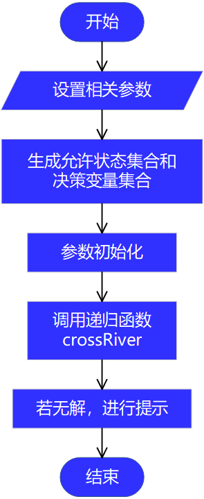
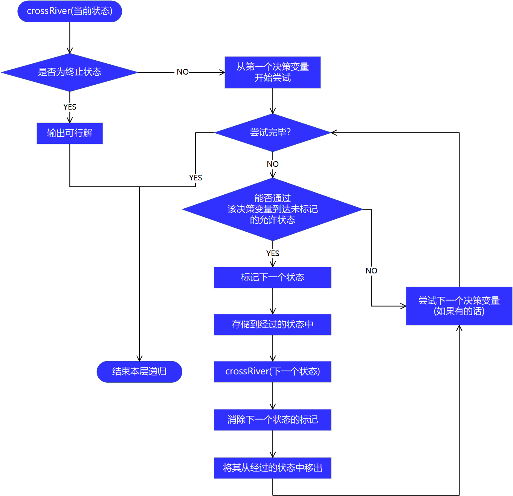
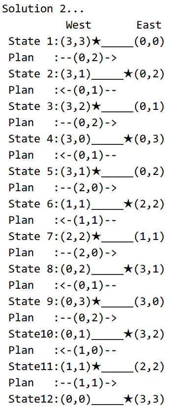
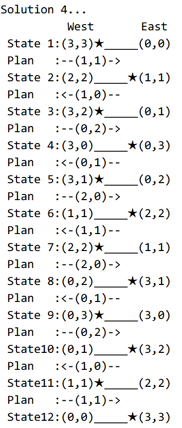

更新于 2024.02.13

### 一、问题描述

3 名商人各带 1 名随从过河(从西岸到东岸)，一只小船最多能容纳 2 人。随从们约定：在河的任意一岸，若随从人数多于商人人数，就杀人越货. 但商人们知道了他们的约定，并且掌握着过河大权，他们该采取怎样的策略才能安全过河？


### 二、算法思想

这个问题实际上是一个<font color=red>**迷宫问题**</font>，为什么这样说呢？请听我慢慢道来.

首先，我们将每次渡河前西岸的人员分布和船所在的位置统称为一个<font color=red><b>"状态"</b></font>，用 $\small [u,v,1/0]$ 表示，其中 $u,v$ 表示商人、随从在西岸的人数，末分量表示船的位置：1 表示船在西岸，0 表示船在东岸.将符合条件的状态挑出来组成<font color=red>**允许状态集合**</font>.

其次，船最多可容纳两个人. 将渡河方案用 $\small [u,v]$ 表示，其中 $u,v$ 分别表示上船的商人数和随从数，并将其称为<font color=red>**决策变量**</font>，决策变量构成的集合称为<font color=red>**决策变量集合**</font>.

共有 20 种允许状态和 5 个决策变量.

<font color=blue>**初始状态**</font>为 $\small [3,3,1]$：3 名商人、3 名随从在西岸，船停靠在西岸；

<font color=blue>**终止状态**</font>为 $\small [0,0,0]$：0 名商人、0 名随从在西岸，船停靠在东岸，此时商人和随从全部到达东岸，这样就确定了"迷宫"的入口和出口.

从一个状态变换到另一个状态是通过决策变量实现的，这里的决策变量也就相当于"迷宫"中的一段路.

所以，我们的任务就是选择可行的路径，从"迷宫"的入口走到出口.

现在你应该觉得这好像是个迷宫问题，但心中应当还存有怀疑，因为只有入口和出口的话，并不能称得上是迷宫问题，那还有什么其他的特点呢？

想想我们是怎样解决迷宫问题的？从入口出发，沿某一方向前进，若能走通，则继续往前走；如果不能走通或是有某一分叉可以抵达出口，则沿原路退回到刚刚的分叉点，换个方向继续前进. 重复这个过程，直至探索出所有可能的通路.

这个问题也是这样的，从初始状态开始，尝试某种渡河方案，若能到达未经过的允许状态，则采取该渡河方案；如果不能到达任何一种允许状态或者是能够抵达终止状态，则原路返回至刚刚的状态，尝试其他的渡河方案. 重复这个过程，直到探索出所有的渡河方案.

读到这儿，你可能会感觉到，这真的就是一个迷宫问题. 好，既然你认同了，咱就继续往下说.


### 三、如何实现

怎样利用程序来解决这类问题呢？<font color=red>**栈+回溯**</font>.

<font color=red>**栈**</font>(什么是栈？你可以把它简单地想象成桶装薯片(只有一端开口)，你只能从上面的薯片依次往下吃才能吃到最后一个，而不能直接吃到最后一个)，具有"后进先出"的特性，所以我们用它来存储经过(或已标记)的状态。

初始情况：起始状态已被标记，放在栈中. 考虑某一当前状态(已标记)，则<font color=red>**回溯法**</font>的基本思想是：

1. 若当前状态是终止状态，则输出路径，之后进行**回溯**，即返回上一层，去除当前状态标记，当前状态出栈，返回上一状态，上一状态继续尝试没有试过的决策变量；
2. 若当前状态不是终止状态，则依次尝试决策变量：
   - 若当前决策变量能使我到达某个**未标记**的**允许状态**，则将在其上面**做标记**，而后**移动**到那个状态(此时当前状态已发生改变)，进行**递归调用**，在调用语句之后，消除那个状态的标记，将其从栈中移出；
   - 若当前决策变量不能使我到达**未标记**的**允许状态**，则尝试下一决策变量；
   当前状态下所有的决策变量(不论可不可行)都试过之后，进行**回溯**；

正是这种**回溯**机制，保证了所有可行"路径"均能被找到.

### 四、流程图

#### 1. 主程序

<div align=center>

</div>

#### 2. 递归函数 crossRiver

<div align=center>

</div>


### 五、源程序代码

#### 1. 主程序 DFS.m

```matlab
clear;clc;
% 商人过河问题

% global 用于声明全局变量
global State D SS;
% State 允许状态集合
% D     决策变量集合
% SS    状态标记集合

m = 3;   % 商人数
n = 3;   % 随从数
max = 2; % 船所能容纳的最大人数

% 1.设置允许状态集合{[u,v,1/0]}
% u,v 分别表示商人、随从在西岸的人数
% 末分量：1 表示船在西岸，0 表示船在东岸

State = [];
numS = 0; % 允许状态的数目
% 设定符合要求的人员状态
% 任意一岸，商人数不小于随从数
% 或者，某一岸商人数为 0
for u = 0:m
    for v = 0:n
        if ((u >= v && (m-u) >= (n-v)) || u == 0 || u == m)  
            numS = numS + 1;
            State(numS,:) = [u,v];         
        end
    end
end
% 设定船的状态
% [u,v,1] 表示船在西岸，[u,v,0] 表示船在东岸
State = [State, ones(numS,1);State, zeros(numS,1)];
numS = numS*2; % 状态数翻倍
disp('允许状态集合:');
State
fprintf('共%d种允许状态\n\n', numS);

% 2.设定决策变量集合
% max: 船所能容纳的最大人数
% [u,v]: u,v 分别表示船上商人和随从人数
D = [];
global numD;
numD = 0; % 决策变量个数
for u = 0:m
    for v = 0:n
        if ((u+v) >= 1 && (u+v) <= max)
            numD = numD + 1;
            D(numD,:) = [u,v];
        end
    end
end
disp('决策变量集合:');
D
fprintf('共%d个决策变量\n\n',numD);

% 3.设置状态访问标记集合
% 对状态进行编号: 1 ~ numS
% SS(i) == 1，表示 i 号状态已访问;
% SS(i) == 0，表示 i 号状态未访问;
SS = zeros(numS,1);

global pos_end;
global pos_passed k count;
% pos_end    终止状态编号
% pos_passed 留下访问标记的状态编号
% k          留下访问标记的状态数目
% count      解的个数

% 初始状态(3,3,1),编号:
pos_begin = find(ismember(State, [3,3,1], 'rows') == 1);
% 终止状态(0,0,0),编号:
pos_end = find(ismember(State, [0,0,0], 'rows') == 1);

% 4.对参数进行初始化
count = 0;          
SS(pos_begin) = 1;          % 在初始位置留下访问标记
pos_passed(1) = pos_begin;  % 留下访问标记的状态编号
k = 1;

% 5.调用递归函数
crossRiver(pos_begin);    

if count == 0
    fprintf('No solution.\n');
end
```

#### 2. 过河函数 crossRiver.m

```matlab
function crossRiver(pos_currentS)
% pos_currentS 当前状态编号

% 全局变量
global State D numD SS;
% State 允许状态集合
% numD  决策变量数目
% D     决策变量集合
% SS    状态标记集合
global pos_passed pos_end;
% pos_passed 留下访问标记的状态编号
% pos_end    终止状态编号
global k;
% k          留下访问标记的状态数目,初值为1

if pos_currentS == pos_end % 终止情况
    showSolution();
else                       % 非终止情况
    for i = 1:numD
        possibleS = zeros(1,3);  % 事先为可能的状态分配空间      
        possibleS(1,1:2) = State(pos_currentS,1:2) + ((-1)^(State(pos_currentS,3)))*D(i,:);
        % 船从西岸到东岸，西岸人数减少；从东岸到西岸，西岸人数增加.
        possibleS(1,3) = 1 - State(pos_currentS,3);
        % 船的状态也随之改变

        % 按行判断可能的状态是否属于允许状态集合
        sign = ismember(State, possibleS, 'rows'); 
        % 如果可能的状态属于允许状态集合且未被标记，则进行访问
        % 这样做可以避免回到经过的状态，否则程序将陷入死循环
        if sum(sign) == 1
            [pos_next,~] = find(sign == 1);   % pos_next:可能状态的编号
            if SS(pos_next) == 0            % 若未被标记              
                SS(pos_next) = 1;           % 则进行标记    
                k = k + 1;
                pos_passed(k) = pos_next;   % 将其添加到标记点组成的集合中
                crossRiver(pos_next);     % 调用自身，进行递归                            
                SS(pos_next) = 0;           % 消除标记
                k = k - 1;                    % 将其从标记点组成的集合中移出
            end
        end      
    end  
end
```

#### 3. 输出解的函数 showSolution.m

```matlab
function showSolution()
% 全局变量
global State pos_passed k count;
% State   允许状态集合
% pos_passed  留下访问标记的状态编号
% k       留下访问标记的状态数目，初值为1
% count   解的个数，初值为0

count = count + 1;
fprintf('Solution %d...\n', count);
fprintf('\t\t  West       East\n');
for i = 1:k 
    % 输出经过的状态
    fprintf(' State%2d:(%d,%d)', i, State(pos_passed(i),1), State(pos_passed(i),2));
    if State(pos_passed(i),3) == 1      % 船在西岸
        fprintf('★_____');  % ★ 表示船
    else % State(pos_passed(i),3) == 0  % 船在东岸
        fprintf('_____★');
    end
    fprintf('(%d,%d)\n', 3 - State(pos_passed(i),1), 3 - State(pos_passed(i),2));
    % 输出渡河方案
    if i ~= k
        if State(pos_passed(i),3) == 1
            fprintf(' Plan\t:--(%d,%d)->\n', State(pos_passed(i),1) - State(pos_passed(i+1),1), State(pos_passed(i),2) - State(pos_passed(i+1), 2));
        else
            fprintf(' Plan\t:<-(%d,%d)--\n', State(pos_passed(i+1),1) - State(pos_passed(i),1), State(pos_passed(i+1),2) - State(pos_passed(i),2));
        end
    end
end
fprintf('\n');
end
```


### 六、求解结果

<div align=center>




</div>


### 七、小结

这是一个经典的过河问题，本质就是在各允许状态之间寻找符合要求的路径，考虑到可能有多条路径，需要使用栈保存经过的状态，以便回溯. 几点心得：

1. 合适的数据结构——<font color=#00A600>**栈**</font>，对于此问题的处理起到了至关重要的作用；
2. 对允许状态进行<font color=#00A600>**编号**</font>，方便编程，同时增强了程序的通用性；
3. 采用<font color=#00A600 >**标记**</font>的方式记录经过的状态，与直接删除经过的状态相比，有着很大的优越性，一是保证了回溯的进行，二是避免了删除操作；
4. 类似的问题还有<font color=#0000c6><b>八皇后问题、人狗鸡米过河问题</b></font>以及其他版本的过河问题；


Plus: 如有错误、可以改进的地方、或任何想说的，请在评论区留言！