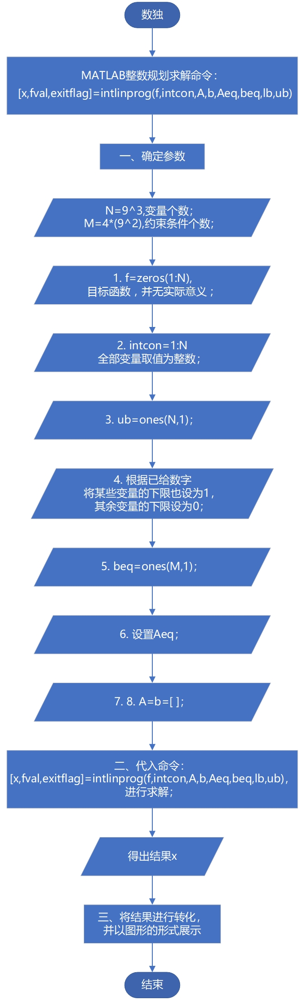
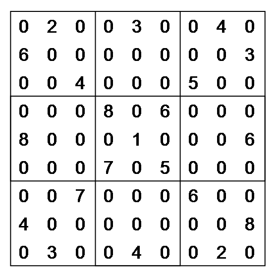
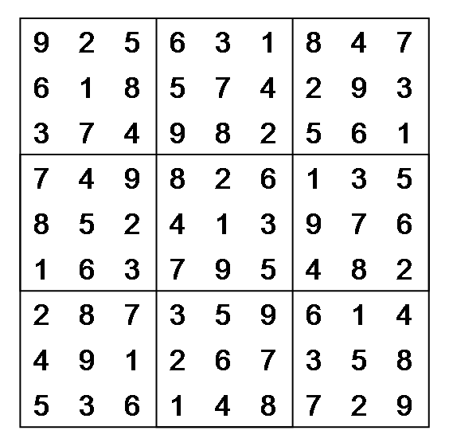
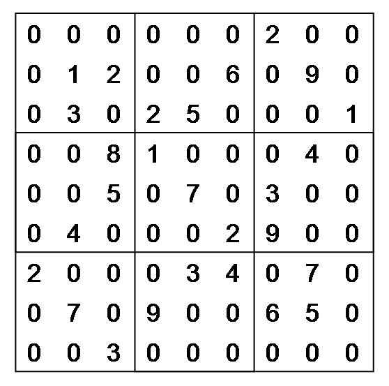
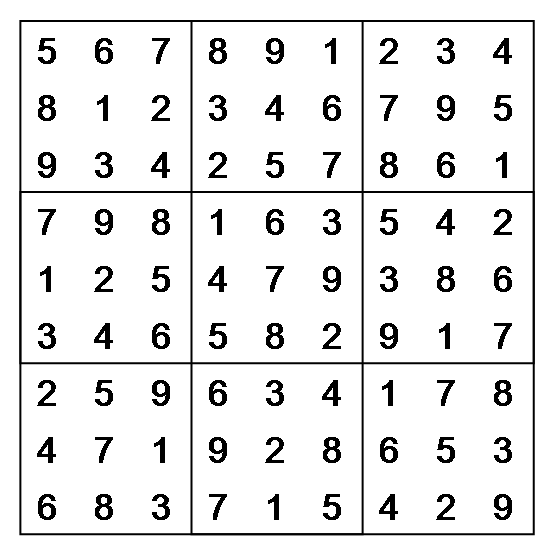

### 一、问题描述
数独是源自18世纪瑞士的一种数学游戏，盘面是个九宫，每一宫又分为九个小格。在这八十一格中根据已知数字和解题条件，利用逻辑和推理，在其他的空格上填入1-9的数字，使1-9中的每个数字在<font color=red>每一行、每一列和每一宫</font>中都只出现一次。

### 二、模型建立
将 $9\times9$ 的数独矩阵转化为 $9\times9\times9$ 的三维矩阵 ，三维矩阵中每一个元素的值为0或1。例如，若原数独矩阵的第一行第二列的数字为7，则三维矩阵第7层的对应位置为1，其它层该位置皆为0，总共个 $9\times9\times9$ 变量，用 $X(i,j,k)$ 表示第 $k$ 层矩阵的第 $i$ 行第 $j$ 列的元素。

约束条件：

 1. 9层矩阵的同一位置只可以出现一个1：
    $$\sum_{k=1}^9X(i,j,k)=1, i=1,2,\cdots,9,j=1,2,\cdots,9$$
     
 2. 任何一层的任何一行只能有一个1：
    $$\sum_{j=1}^9X(i,j,k)=1, i=1,2,\cdots,9,k=1,2,\cdots,9$$
    
 3. 任何一层的任何一列只能有一个1：
    $$\sum_{i=1}^9X(i,j,k)=1, j=1,2,\cdots,9,k=1,2,\cdots,9$$ 
 
 4. 每层的九宫格中只能有一个1：
    $$\sum_{i=1}^3\sum_{j=1}^3X(i+U,j+V,k)=1,k=1,2,\cdots,9,$$$$U,V\in\lbrace0,3,6\rbrace$$
   
总共 $4\times9^2$ 个约束条件。

利用整数规划求解，MATLAB整数规划命令：
```matlab
[x,fval,exitflag]=intlinprog(f,intcon,A,b,Aeq,beq,lb,ub)
```

建立起来的数学模型：
$$
min f^Tx$$$$\text{subject to} \begin{cases} A\cdot x<=b \\ Aeq\cdot x=beq \\ lb<=x<=ub \\ \text{$x$(intcon) are integers}\end{cases}
$$

### 三、求解思路
聊之前，先说说系数矩阵 $Aeq$ 的构造，从简单说起：

如果要用矩阵表示$\sum_{i=1}^nc{_i}x{_i}$，利用矩阵的乘法，有两种方式：
1.
$$\begin{pmatrix} c_{_1},c{_2},\cdots,c{_n}\end{pmatrix}\begin{pmatrix} x{_1} \\ x{_2} \\ \vdots \\ x{_n}\end{pmatrix}$$
2.
$$\begin{pmatrix} x_{_1},x{_2},\cdots,x{_n}\end{pmatrix}\begin{pmatrix} c{_1} \\ c{_2} \\ \vdots \\ c{_n}\end{pmatrix}$$
我们采用第一种，利用系数向量的转置乘以变量向量：将系数放在相应变量的位置，然后对整个矩阵或者是向量进行转置，有几个约束条件，与之对应的，系数矩阵 $Aeq$ 就有多少行，具体做法见下文代码部分。

**求解思路**：
<div align=center>

</div>

### 四、源程序

#### 1. 主程序 shudu.m
```matlab
clear;clc;
N=9^3;     % 变量个数
M=4*(9^2); % 约束条件个数

% 总体思路是利用整数规划进行求解
% MATLAB整数规划命令：
% [x,fval,exitflag]=intlinprog(f,intcon,A,b,Aeq,beq,lb,ub)
% 分别为目标函数、整型约束、不等式约束，等式约束和解的上下界

% 下面分为几步进行:
% 一、设置参数;
% 二、求解;
% 三、结果显示;


% 一、设置参数
% 1.目标函数，并无实际意义
f=zeros(1,N); 
% 2.intcon:设置某些变量的取值为整数,
% 这里设置全部变量
intcon=1:N;   
% 3.设置A,b
A=[];
b=[];

% 4.设置上下限
% (1).上限
ub=ones(N,1);
% (2).确定下限
X0=zeros(9,9,9);
% 设置数独矩阵B,9x9矩阵
B=[0,0,0,0,0,0,2,0,0
   0,1,2,0,0,6,0,9,0
   0,3,0,2,5,0,0,0,1
   0,0,8,1,0,0,0,4,0
   0,0,5,0,7,0,3,0,0
   0,4,0,0,0,2,9,0,0
   2,0,0,0,3,4,0,7,0
   0,7,0,9,0,0,6,5,0
   0,0,3,0,0,0,0,0,0];
% 显示原始数独矩阵
showShudu(B);
% 根据数独矩阵确定某些变量的下限为1
% 这些变量为已知条件，上限也为2，在求解过程中不会变动
for i=1:9
    for j=1:9
        if B(i,j)~=0
            X0(i,j,B(i,j))=1;
        end
    end
end
% trans:自定义函数，对参数中的每一个二维矩阵进行转置操作
% 这样做是因为reshape命令是按照列来提取矩阵中的元素
% 在本问题中，变量是按行排列的
% 所以为了获取等式约束中的系数，需要进行转置操作
X0=trans(X0);
lb=reshape(X0,N,1);
    

% 5.设置beq
beq=ones(M,1);
% 6.设置Aeq
Aeq=zeros(M,N);
count=1; % 用于遍历Aeq的列数
% i,j,k分别表示行数、列数、层数
% Amid用于向Aeq中输入变量前的系数
% 为了与变量相对应，同样需要进行转置操作

% (1).任何一层的任何一行只能有一个1 
for k=1:9
    for i=1:9
        Amid=zeros(9,9,9); % 清空Amid
        Amid(i,:,k)=1;     % 某一层的某一行设为1     
        Aeq(count,:)=reshape(trans(Amid),1,N);
        count=count+1;
    end
end

% (2).任何一层的任何一列只能有一个1 
for k=1:9
    for j=1:9
        Amid=zeros(9,9,9);  % 清空Amid
        Amid(:,j,k)=1;      % 某一层的某一列设为1
        Aeq(count,:)=reshape(trans(Amid),1,N);
        count=count+1;
    end
end

% (3).9层矩阵的同一位置只可以出现一个1 
for i=1:9
    for j=1:9
        Amid=zeros(9,9,9); % 清空Amid
        Amid(i,j,:)=1;     % 所有层的某一位置设为1
        Aeq(count,:)=reshape(trans(Amid),1,N);
        count=count+1;
    end
end

% (4).九宫格约束
for k=1:9
    for u=0:3:6
        for v=0:3:6
            Amid=zeros(9,9,9);        % 清空Amid
            Amid(u+1:u+3,v+1:v+3,k)=1;% 小九宫格位置设为1
            Aeq(count,:)=reshape(trans(Amid),1,N);
            count=count+1;
        end
    end
end
    

% 二、求解
% 整数规划范式：
% x=intlinprog(f,intcon,A,b,Aeq,beq,lb,ub)
[x,~,exitflag]=intlinprog(f,intcon,A,b,Aeq,beq,lb,ub);


% 三、结果显示
if exitflag<=0
    fprintf('解不存在.\n');
else% exitflag>0,说明存在解
    X1=reshape(x,9,9,9);
    % 利用intlinprog得到的解不一定是十分准确的整数，在此整数化
    X1=round(trans(X1));   
    % 每层的矩阵都乘以对应的层数，从而得到该位置应填入的数字
    for k=1:9 
        X1(:,:,k)=k*X1(:,:,k);
    end
    % 合并第三维(对应位置元素相加)，得到完成后的数独矩阵
    C=round(sum(X1,3)); 
    % 结果显示
    showShudu(C);
end
```

#### 2. 三维矩阵的转置函数 trans.m
```matlab
function B=trans(A)
% 实现三维数组的转置
[~,~,p]=size(A);
B=zeros(size(A));
for k=1:p
    B(:,:,k)=A(:,:,k)';
end
```

#### 3. 显示矩阵的函数 showShudu.m
```matlab
function showShudu(A)
% 以九宫格的形式显示矩阵,A:9x9矩阵

figure;hold on;
axis off;axis equal;
% 画线
rectangle('Position',[0.2,0,9,9],'LineWidth',1); % outside border
rectangle('Position',[0.2,3,9,3],'LineWidth',1); % horizontal lines
rectangle('Position',[3.2,0,3,9],'LineWidth',1); % vertical lines

for i=1:9
    for j=1:9
        text(j-0.5,9.5-i,num2str(A(i,j)),'FontSize',18);
    end
end
```

### 五、结果展示
<div align=left>


</div>
......再来一组
<div align=left>


</div>

感谢欣赏，下期再见！